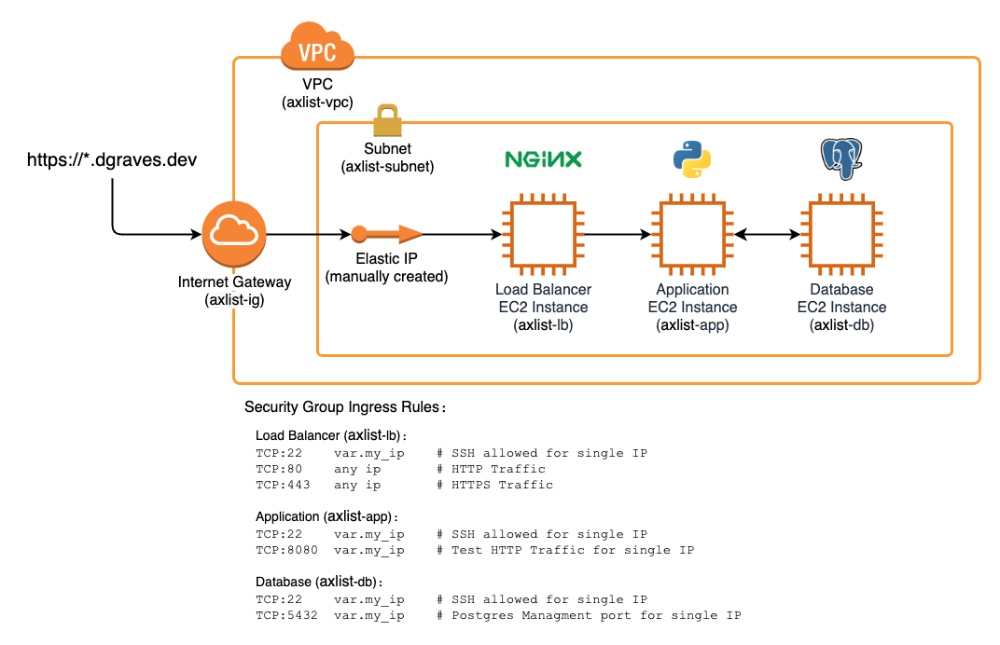

axlist-deploy
=============

The repository of deployment resources for [axlist-app](https://github.com/davgra04/axlist-app), intended as a learning exercise for using Ansible. This repo uses the following for deployment:

* Amazon Web Services
* Terraform
* Ansible



# Deploying

## Spin up instances with Terraform

1. Manually create Elastic IP
   * We want this to persist outside of Terraform so DNS config remains unchanged
2. Set up DNS routing
   * Configure the domain provider's DNS settings with an A Record pointing to the Elastic IP.
3. Generate new key to use in AWS
   ```bash
   ssh-keygen -t rsa -C this-is-my-server-key -f ~/.ssh/whatever.key
   ```
4. Configure Terraform vars file
   ```bash
   # deployment.tfvars

   eip_allocation_id = "eipalloc-d3adb33fd3adb33f"     # elastic ip to associate instance with
   my_ip = "8.8.8.8"                                   # IP to whitelist for SSH

   instance_type_lb = "t2.nano"                        # instance size for load balancer
   instance_type_db = "t2.nano"                        # instance size for database
   instance_type_app = "t2.nano"                       # instance size for application

   key_name = "this-is-my-server-key"                  # key name
   private_key_path = "~/.ssh/whatever.key"            # private key path
   public_key_path = "~/.ssh/whatever.key.pub"         # public key path
   ```
5. Spin up infrastructure with Terraform
   ```bash
   # Set the terraform workspace for the current deployment
   cd tf/
   terraform workspace select my-deployment

   # init and launch using .tfvars file
   terraform init
   terraform apply -var-file="deployment.tfvars" --auto-approve
   ```

## Provision instances using Ansible

1. Create python virtual environment
   ```bash
   cd ansible/
   python3 -m venv ./env
   source env/bin/activate
   pip install -r requirements.txt
   ```
2. Install prerequisite Ansible modules
   ```bash
   ansible-galaxy collection install community.general
   ```
3. Configure `[default]` AWS authentication credentials
   * The aws_ec2 module relies on `~/.aws/credentials` and `~/.aws/config` to authenticate. [Read more on this configuration here](https://boto3.amazonaws.com/v1/documentation/api/latest/guide/quickstart.html#configuration).
4. (Optional) Ping instances to check connectivity
   ```bash
   ansible -i aws_ec2.yaml all -m ping
   ```
5. Run main playbook
   ```bash
   ansible-playbook -i aws_ec2.yaml site.yml
   ```